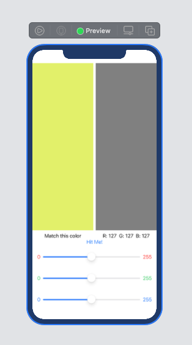

# Getting Started with SwiftUI



* Create a new project selecting both SwiftUI and SwiftUI App, Its will create Two file projectName.swift and ContentView.swift files

*projectName.swif*
* Here our app will start at @main method
* In this approach we will initialize our App, Scene and Window, where we will call our workin struct ContentView()

```swift
import SwiftUI
@main
struct SwiftUI_ColorFinderApp: App {
    var body: some Scene {
        WindowGroup {
            ContentView(guessR: 0.5, guessG: 0.5, guessB: 0.5)
               
        }
    }
}
```
*ContentView.swift*
In ContentView we will write the following code

```swift

import SwiftUI

struct ContentView: View {
    let randomR = Double.random(in: 0...1)
    let randomG = Double.random(in: 0...1)
    let randomB = Double.random(in: 0...1)
    @State var guessR: Double
    @State var guessG: Double
    @State var guessB: Double
    @State var alertEnabled = false
    private func scoreFinder() -> Int{
        let red = randomR-guessR
        let green = randomG-guessG
        let blue = randomB-guessB
        let result = sqrt(red*red + green*green + blue*blue)
        return Int((1-result)*100 + 0.5)
    }
    @State var showingAlert = false
    var body: some View {
        VStack{
            HStack{
                VStack{
                    Rectangle()
                        .foregroundColor(Color(red: randomR, green: randomG, blue: randomB, opacity: 1.0))
                    //.frame(height: 160.0)
                    if showingAlert{
                        Text("R: \(randomR*255.0, specifier: "%.0f") G: \(randomG*255.0, specifier: "%.0f") B: \(randomB*255.0, specifier: "%.0f")")
                    }else{
                        Text("Match the Color")
                    }
                }
                VStack{
                    Rectangle()
                        .foregroundColor(Color(red: guessR, green: guessG, blue: guessB, opacity: 1.0))
                    //.frame(height: 160.0)
                    Text("R: \(guessR*255.0, specifier: "%.0f") G: \(guessG*255.0, specifier: "%.0f") B: \(guessB*255.0, specifier: "%.0f")")
                }
                
            }
            HStack{
                //            Button(action: {
                //                self.showingAlert = true
                //            }) {
                //                Text("Show Result")
                //            }
                //            .alert(isPresented: $showingAlert) {
                //                Alert(title: Text("Score"), message: Text("Your Score is: \(score)"), dismissButton: .default(Text("Got it!")))
                //            }
                
                AlertView(showingAlert: $showingAlert, score: scoreFinder())
            }
            //            HStack{
            //                Text("0").foregroundColor(.red)
            //                Slider(value: $guessR)
            //                Text("255").foregroundColor(.red)
            //            }
            ColorSlider(guessColorValue: $guessR, color: .red)
            ColorSlider(guessColorValue: $guessG, color: .green)
            ColorSlider(guessColorValue: $guessB, color: .blue)
        }
    }
}
struct AlertView: View {
    @Binding var showingAlert: Bool
    var score: Int
    
    var body: some View {
        Button(action: {
            self.showingAlert = true
        }) {
            Text("Show Result")
        }
        .alert(isPresented: $showingAlert) {
            Alert(title: Text("Score"), message: Text("Your Score is: \(score)"), dismissButton: .default(Text("Got it!")))
        }
    }
}
struct ColorSlider: View{
    @Binding var guessColorValue: Double
    var color: Color
    var body: some View{
        HStack{
            Text("0").foregroundColor(color)
            Slider(value: $guessColorValue)
            Text("255").foregroundColor(color)
        }
    }
}
struct ContentView_Previews: PreviewProvider {
    static var previews: some View {
        ContentView(guessR: 0.5, guessG: 0.5, guessB: 0.5)
    }
}

```

* First of all we will crate some random variable to crate an arbitrary color rectangle
* And we will crate some guess variable of @State type, State is a property wrapper, can read and write into the views owned by SwitUI, for outside use we will use @Binding property wrapper type
* We will crate some VStack and HStack as per needed, create two rectangle with guess and random using property
* We will create two SubView ColorSlider for crate slider dynamically and AlertView to show the result.
* Here scoreFinder Method will help us to find the value of user assumption 
